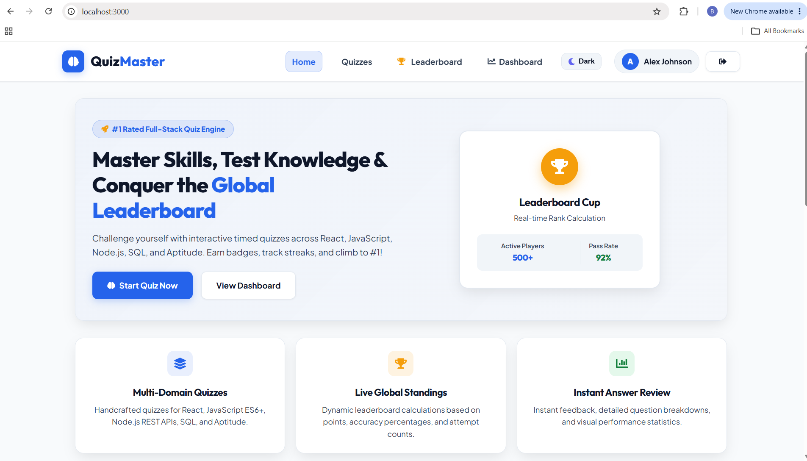
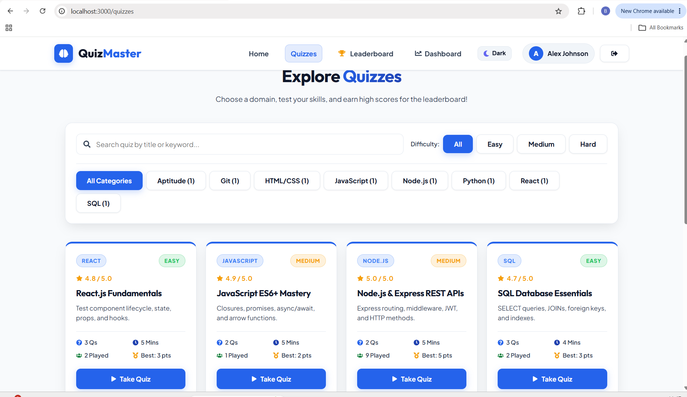
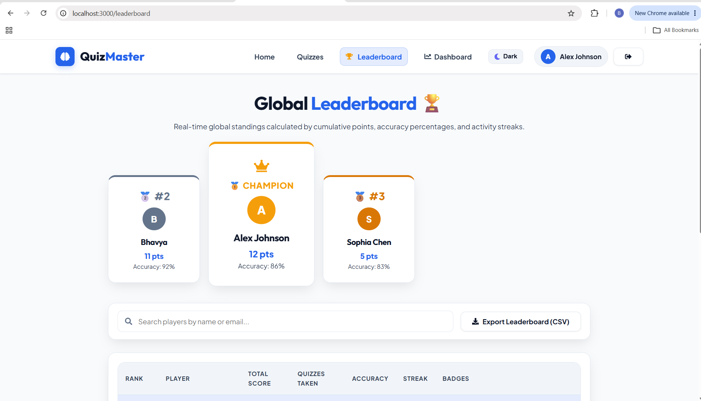
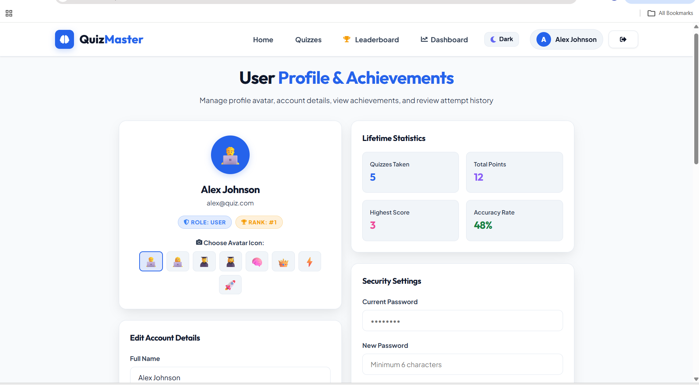
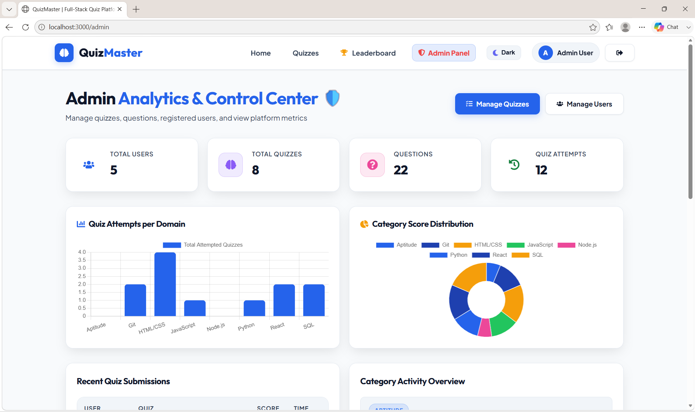
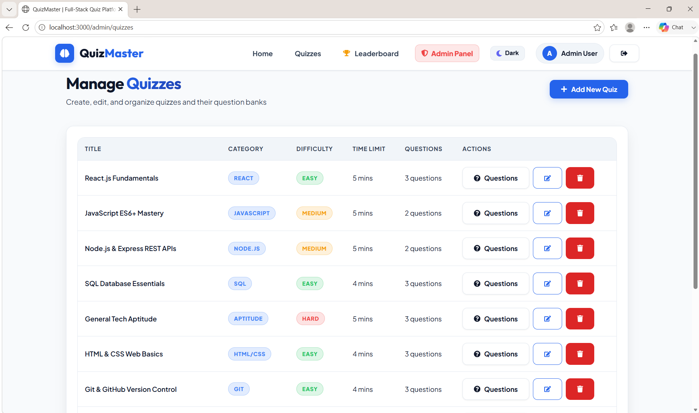
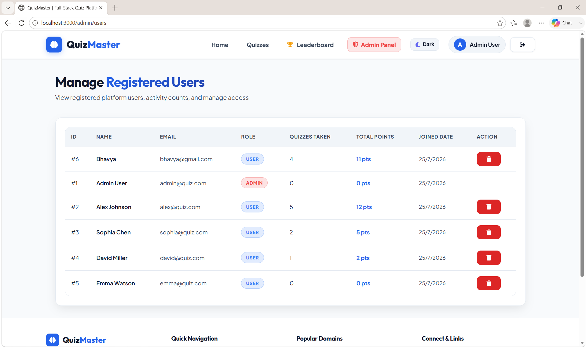

# 🧠 QuizMaster - Full-Stack Quiz Platform with Live Leaderboard

Intern Name      : Gadamanipalli RajaSekhar
Intern ID        : CT-5115
Organization     : CODTECH IT Solutions
Domain           : Full Stack Web Development


> **Full-Stack Web Development Internship Project**  
> A feature-rich, high-performance web application built with **Node.js, Express.js, React (Vite), JWT Authentication, SQLite/MySQL, and Chart.js**.

---

## ✨ Features Overview

### 🌟 User Features
- 🔐 **JWT Authentication & RBAC**: Secure User Registration and Login with encrypted passwords (`bcrypt`).
- ⏱️ **Interactive Timed Quiz Engine**:
  - Live Countdown Timer with visual Progress Bar.
  - Automatic submission when time expires.
  - Randomized question order for each attempt.
- 🎯 **Instant Results & Answer Review**:
  - Detailed score percentage calculation.
  - Option-by-option answer breakdown highlighting correct vs. wrong choices.
- 🏆 **Global Real-Time Leaderboard**:
  - Live rank calculation based on total score, accuracy percentage, and attempt counts.
  - Metallic podium presentation for Top 3 players (🥇 Champion, 🥈 Master, 🥉 Expert).
  - Search filter by player name or email.
  - **Export Leaderboard to CSV**: One-click download of rankings into Excel/CSV format.
- 👤 **User Profile & Custom Avatars**:
  - Editable user details (Name, Email, Password).
  - Preset Avatar Selector (👨‍💻, 👩‍💻, 🧠, 👑, ⚡).
  - Unlocked Badges & Achievements tracking (*First Steps*, *Quiz Scholar*, *High Flier*, *Leaderboard Hero*).
  - Personal Quiz Attempt History Log.
- 🌓 **Dark & Light Mode Toggle**: Smooth theme switching with persistent state saved in `localStorage`.

### 🛡️ Admin Features
- 📊 **Analytics Dashboard**:
  - Interactive **Chart.js Bar Chart** (Quiz attempts per category).
  - Interactive **Chart.js Doughnut Chart** (Category score distribution).
- ⚙️ **Quiz & Question Management**:
  - Full CRUD operations for Quizzes (Title, Description, Category, Difficulty, Time Limit).
  - Full CRUD operations for Question Bank (Options 1–4, Correct Option, Marks).
  - User management (View registered users, attempts, delete accounts).

---

## 🛠️ Technology Stack

### Frontend
- **Framework**: React 18 + Vite
- **Routing**: React Router DOM (v6)
- **State Management**: Context API (AuthContext, ThemeContext)
- **HTTP Client**: Axios with Interceptors
- **Charts**: Chart.js & react-chartjs-2
- **Icons**: React Icons (Font Awesome)
- **Notifications**: React Toastify
- **Styling**: Vanilla CSS3 (Custom Design System with CSS Variables)

### Backend
- **Runtime**: Node.js
- **Framework**: Express.js
- **Authentication**: JSON Web Tokens (JWT) & bcryptjs
- **Database Resilience**: Dual Adapter supporting **MySQL2** and zero-config local **SQLite3** (`quiz_platform.db`)
- **Security**: CORS, dotenv environment configuration

---

## 🚀 Getting Started

### 1. Prerequisites
- Node.js (v16+ recommended)
- npm or yarn

### 2. Backend Setup
```bash
cd backend
npm install
npm start
```
*The backend server starts on `http://localhost:5001` and automatically initializes SQLite migration and database seeding if MySQL is absent.*

### 3. Frontend Setup
```bash
cd frontend
npm install
npm run dev
```
*The frontend Vite development server runs at `http://localhost:3000`.*

---

## 📁 Directory Structure

```
Quizplatform/
├── backend/
│   ├── config/          # Database dual adapter (MySQL & SQLite)
│   ├── controllers/     # Auth, Quiz, Question, Attempt, Leaderboard logic
│   ├── database/        # SQLite DB storage & SQL schema file
│   ├── middleware/      # JWT Authentication & Admin RBAC verification
│   ├── routes/          # Express route definitions
│   └── server.js        # Main Express server entry point
│
└── frontend/
    ├── src/
    │   ├── components/  # Navbar, Footer, QuizCard, StatCard, Timer, ProgressBar
    │   ├── context/     # AuthContext, ThemeContext
    │   ├── pages/       # Home, Quizzes, QuizPlay, Result, Leaderboard, Profile, Admin Dashboard
    │   ├── services/    # Axios API instance
    │   └── styles/      # Global Design System CSS & variables
    └── vite.config.js
```
## Screen shots 

## User

## Quizzes

## Leaderboard

## User Profile


## Admin panel




---

## 📄 License
This project is open source and created as part of a **Full-Stack Web Development Internship Deliverable**.
